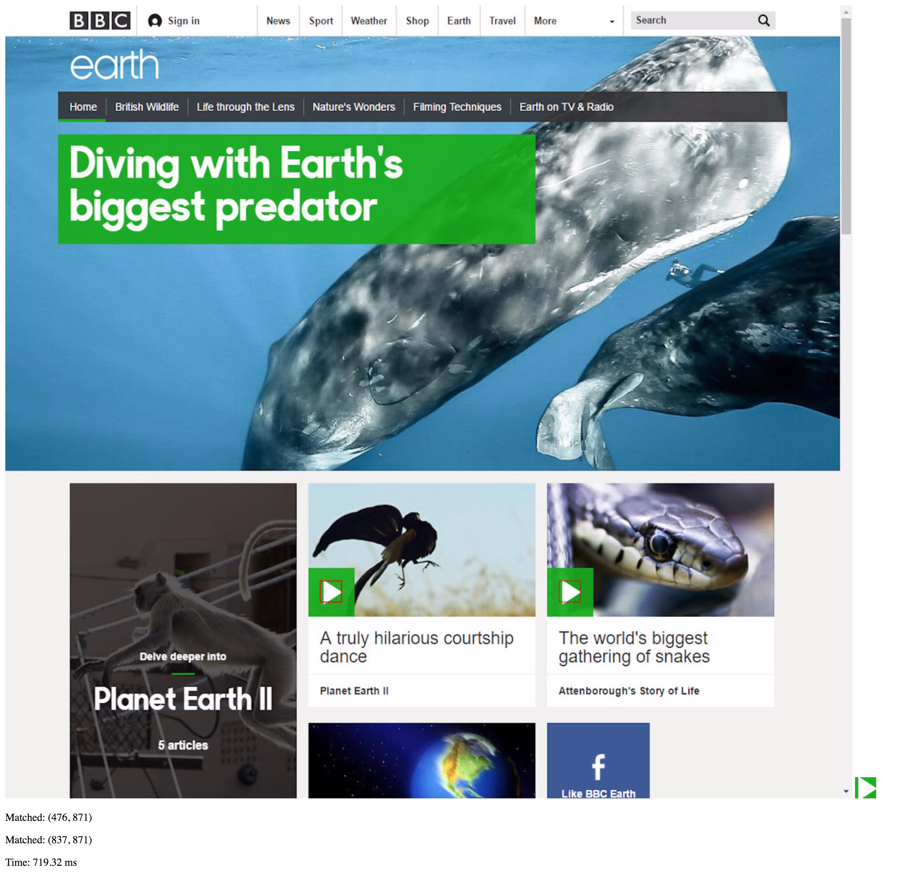

# template-match-webgl
Template matching using WebGL

## Overview
This project illustrates how WebGL may be utilized to perform fast template matching on large images in JavaScript. 

See [this OpenCV page](http://docs.opencv.org/2.4/doc/tutorials/imgproc/histograms/template_matching/template_matching.html) for background information; this project implements the `CV_TM_SQDIFF` matching method in a fragment shader. 

## Example
Below is a screenshot after having performed template matching on a 1280x1200 source image (using a 32x32 template image):

The template image is in the lower right corner; in this example two matches have been found in the source image.

To try this example out, run an HTTP server in the project directory and navigate to it in the web browser.